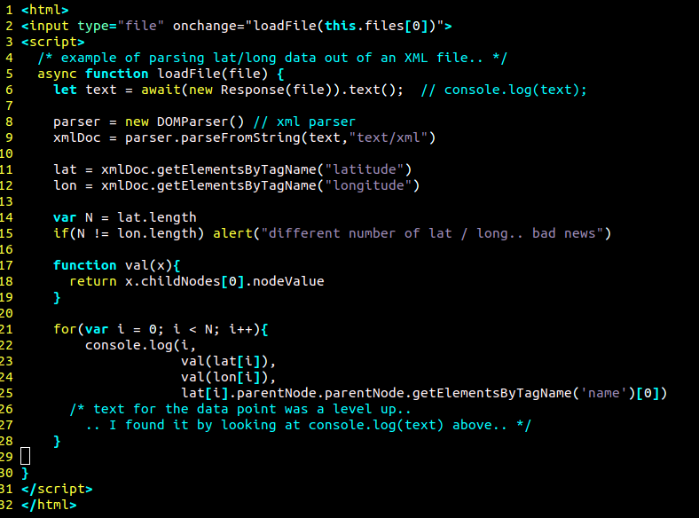

# js_kml_parse_lat_lon
Simple example of parsing lat / lon out of a KML file.. From JavaScript

## Instructions:
Download both files, 
[kml.html](https://github.com/ashlinrichardson/js_kml_parse_lat_lon/raw/master/kml.html)
and 
[BCGov_Web_Map_Library.kml](https://github.com/ashlinrichardson/js_kml_parse_lat_lon/raw/master/BCGov_Web_Map_Library.kml)

open the html file in a browser, and select the KML file.. 
.. latitude and longitude will appear in console.log

## kml.html

